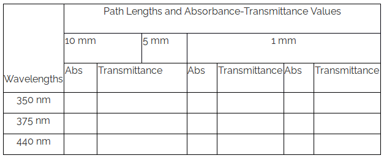

- To understand the relationship between the sample path length and the absorbance of a given sample, click on the first Simulator. To determine the relationship between the sample path length and the absorbance of a given sample, click on the second Simulator and proceed as follows.

1. Turn on the instrument clicking on the power button and wait for 30 min for initialization of the instrument.
2. Make, say 0.001 M, aqueous solution of potassium dichromate in 0.01 N H 2 SO 4 .
3. Click on the beaker to take a clean, dry beaker. Click on the volumetric flask to pour the solution into the clean, dry beaker.
4. Click on the micropipette to collect appropriate quantity of solution from the beaker. Take a cuvette by clicking on it.
5. Pour the solution from the micropipette into the cuvette by clicking on the cuvette. (In actual measurements, the cuvette is filled to approx. two-third of its volume.)
6. Click on the spectrophotometer lid to open it.
7. Click on the cuvette to place it in the sample holder. One has to use aq. 0.01 N H 2 SO 4 as the sample blank or reference in this measurement. Here a double beam spectrophotometer is shown. In this case, one can place the sample in the sample holder and the sample bank or reference in the reference holder simultaneously.
8. Run the wavelength scan by clicking on the Computer monitor and then on the Scan button and observe the wavelength scan. In the real spectrophotometer operation, an appropriate wavelength range of incident light for the sample can be chosen and the wavelength scan are run via the accompanied computer software. One can run the scan in absorbance or transmittance mode. The scan data is stored in the computer. If the spectrophotometer is a single beam instrument, then first the sample blank or reference is taken in a cuvette and the wavelength scan is run followed by the sample. One has to subtract the reference data from the sample data for respective wavelengths.
9. Click on Reset button to start new measurement. Repeat the measurements with cuvettes of different path lengths.
10. Collect all data by clicking on the Data tab. Plot the absorbance of the sample at various wavelengths for different path lengths and determine the wavelength of maximum absorptions i.e., spectral peak-positions.
11. Plot the absorbance values for a particular wavelength (say, 350 nm) vs. path lengths and calculate linear regression. Note down the correlation coefficient which is a measure of the quality of a calibration and here tells how good a straight line fits to all of the calibration points.
12. Repeat the plotting of the absorbance values vs. path lengths for two other wavelengths say, 375 nm and 440 nm and calculate linear regressions.
13. Construct similar three plots taking transmittance in place of absorbance values vs. path lengths for three wavelengths 350 nm, 375 nm and 440 nm and calculate linear regressions. Note down the correlation coefficients.
14. Verify the Lambert Law observing whether absorbance and transmittance values have linear correlation with path length or not.
15. Normalize absorbance measurements to 1 mm path length by dividing the absorbance data by the corresponding path length for a given wavelength. Are the normalized data (within experimental error) path length-specific at a given wavelength? Discuss your results.

Table 1. Measured Absorbance and Transmittance values at different path lengths for different wavelengths 

